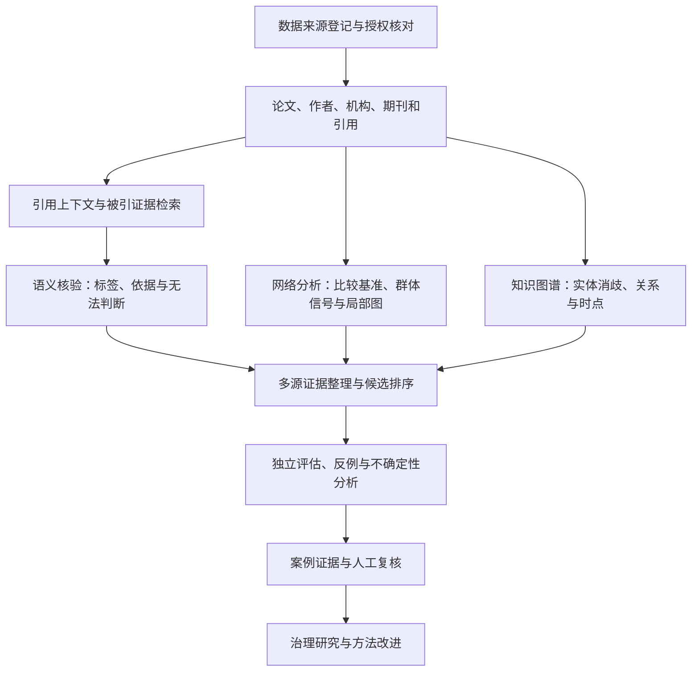

# 技术路线与共享接口

以下为项目设计，不是已部署系统。

## 两条检测路线互补

语义路线判断具体引用主张是否得到支持；网络路线分析观察范围中的群体行为。语义高风险结果可以作为网络扩展的种子或属性，但不能删除其他引用边，也不能成为群体分析的唯一入口。

全文或证据缺失应输出“无法判断”，不要按无关处理。Ego 子图便于解释，但不能替代完整观测范围下的统计基准。

## 统一的数据交接

| 上游产物 | 下游需要 | 最小记录 |
|---|---|---|
| 数据快照 | 所有方法 | 来源、版本、时间/学科范围、采样与许可 |
| 引用实例 | 语义模型和案例 | instance_id、上下文、证据定位、原始标签 |
| 引用图 | 网络方法和图谱 | 节点类型、有向边、权重定义、时间窗口 |
| 候选群体 | 联合分析和案例 | 群体 ID、所含节点、run_id、参数、指标 |
| 主体关系 | 证据解释 | 实体 ID、关系、来源、时点和消歧置信信息 |
| 方法输出 | 评估和复核 | 输出粒度、score 含义、缺失项与失败情况 |

详细字段见[Schema](../data/schema.md)。不同层级用显式映射连接：引用实例不是论文对，论文对不是期刊聚合边，候选群体也不等于一份已确认案例。

## 融合与解释

先并列呈现语义、结构、关系和时间证据，观察各自贡献，再考虑候选排序。任何加权规则、阈值和概率表述都需要相应验证；不得把未经校准的加权分数命名为“学术不端概率”。

正常合作、学科热点、综述引用、样本边界和实体误对齐都应作为替代解释检查。
