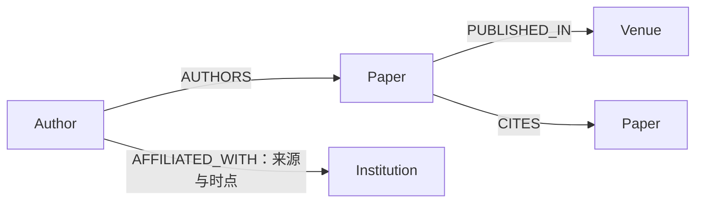

# 学术知识图谱

状态：`planned`。当前提供最小设计，不代表数据库已经构建。

## 实体与关系

首版采用Paper、Author、Institution、Venue四类实体，以及引用、署名、机构关联、发表四类关系。可以先用结构化表表达，再根据查询需求选择图存储实现。

机构关联要标注时点；共同署名推导合作关系时，注明它是派生关系与具体规则。不能从名称相同直接合并实体。

## 对接和扩展

基础字段见[Schema](../../data/schema.md)。输入、来源、缺失与消歧规则先于复杂推理。TransE、RotatE或GNN只在有明确任务、对照和评估标签时引入，不把链接预测自动解释为真实利益关系。

验证关注：外键完整性、消歧抽检、关系出处、时间一致性与案例可追溯性。
